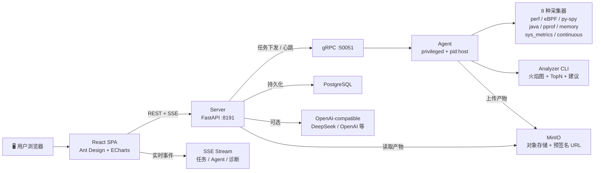

<p align="center">
  <h1 align="center">🔥 Mini-Drop</h1>
  <p align="center"><strong>轻量级 Linux 性能诊断平台</strong> — 火焰图 · eBPF · AI 归因 · 自然语言采集</p>
</p>

<p align="center">
  
  
  
  
  
  
</p>

---

## 📖 目录

- [快速开始](#快速开始)
- [功能一览](#功能一览)
- [架构](#架构)
- [Web 前端](#web-前端)
- [CLI 命令](#cli-命令)
- [采集器](#采集器)
- [智能归因](#智能归因)
- [ChatOps 通知](#chatops-通知)
- [安全](#安全)
- [AI Provider](#ai-provider)
- [开发](#开发)
- [仓库结构](#仓库结构)
- [设计原则](#设计原则)

---

## 快速开始

```bash
# pip 安装
pip install micro-drop
micro-drop serve          # 终端 1：启动 Server（HTTP :8191 + gRPC :50051）
micro-drop agent          # 终端 2：启动 Agent（自动注册 + 心跳拉取任务）

# 浏览器打开 http://localhost:8191/docs 查看 API 文档
```

**Docker 全栈部署（推荐生产验证）：**

```bash
git clone https://github.com/jiangyulin1/mini-drop.git
cd mini-drop
cp .env.example .env        # 编辑 .env 填入密钥
docker compose up -d        # 启动 4 个服务：Postgres + MinIO + Server + Agent + Web
# 浏览器打开 http://localhost
```

**运行测试：**

```bash
make test                   # 300 个测试
make coverage               # 需先 pip install -e ".[dev]"
```

---

## 功能一览

### 🎯 核心能力

| 模块 | 能力 | 说明 |
|------|------|------|
| **采集器** | 8 种 | perf CPU / eBPF IO / py-spy / Java async-profiler / Go pprof / Memory smaps / SysMetrics / Continuous |
| **火焰图** | 交互式 | d3-flame-graph 点击缩放 + 搜索高亮 + ECharts TopN 联动 |
| **AI 归因** | 5 层引擎 | 证据采集 → 候选生成 → 置信度校准 → LLM 推理 → 修复计划 |
| **自然语言** | NLP 采集 | "mysqld CPU 飙高" → 自动选采集器 + 参数 → 一键创建 |
| **ChatOps** | 5 平台 | 企业微信 / 飞书 / 钉钉 / Slack / QQ 机器人 |
| **Web 前端** | 6 页面 | 任务面板 · 任务详情 · 诊断历史 · Agent 详情 · 审计日志 · 系统设置 |
| **CLI** | 28 条命令 | 全 JSON 输出，适合管道 / CI / 脚本 |
| **实时推送** | SSE | 任务状态变更 / Agent 上下线 / 诊断完成即时通知 |

### 🖥️ Web 前端

```
任务面板 (/)          — 总览统计、NLP 输入、任务/Agent 列表、SSE 实时通知
任务详情 (/task/:id)   — 火焰图 + TopN 联动、状态时间线、产物表、AI 归因 + 反馈
诊断历史 (/diagnoses)  — 全量诊断记录、置信度筛选、搜索过滤、准确率统计
Agent 详情 (/agent/:id) — 资源趋势折线图、采集能力标签、关联任务列表
审计日志 (/audit)      — 全量审计事件、分页
系统设置 (/settings)   — AI 配置、ChatOps 配置、服务健康、API 认证状态
```

主题：亮色 / **暗色** 一键切换 · SSE 实时连接指示器 · Toast 通知 · 响应式布局

### 🔧 CLI 命令（28 条）

```bash
# ── 基础 ──────────────────────────────────────────
micro-drop serve                                 # 启动 Server
micro-drop agent                                 # 启动 Agent
micro-drop version                               # 显示版本
micro-drop ai-config                             # 打印 AI Provider 配置
micro-drop install-check                         # 检查系统依赖和权限
micro-drop install-check --full                  # 含可选工具的完整检查

# ── 远程管理 ──────────────────────────────────────
micro-drop collect --agent agent_1 --pid 1234    # 一键远程采集
micro-drop status                                # Server/Agent/Task 概览
micro-drop status --agents --tasks               # 含 Agent 资源 + 活跃任务
micro-drop task-cancel --task-id task_xxx         # 取消运行中任务
micro-ddrop diagnose-remote --task-id task_xxx    # 远程触发 AI 诊断
micro-drop watch-task --task-id task_xxx          # 轮询任务直到终止

# ── NLP / AI ─────────────────────────────────────
micro-drop parse "mysqld CPU 飙高"                # 自然语言解析为任务参数
micro-drop summarize --top-json top.json          # AI 热点总结
micro-drop diagnose-local --evidence evidence.json # 本地离线 RCA
micro-drop feedback-stats                        # RCA 反馈准确率统计

# ── 差分 / CI / 告警 ─────────────────────────────
micro-drop diff-top --base before.json --head after.json   # TopN 差分
micro-drop ci-check --base before.json --head after.json   # CI 性能门禁
micro-drop alert --top-json top.json --hotspot-threshold 70 # 热点告警

# ── 批量 / 报告 / 存储 ───────────────────────────
micro-drop batch-diagnose --dir evidence/        # 批量离线 RCA
micro-drop export-summary --top-json top.json --format markdown  # 导出摘要
micro-drop report --top-json top.json --format markdown --output report.md
micro-drop storage-ls                            # 列出对象存储产物
micro-drop storage-prune --older-than-days 30    # dry-run 预览清理
micro-drop storage-prune --older-than-days 30 --execute  # 执行清理
micro-drop agent-exec --diagnosis-id diag_xxx --action-index 0  # 查看修复计划

# ── Shell 工具 ───────────────────────────────────
micro-drop keywords --kind collectors            # 打印关键词字典
micro-drop suggest per                           # 前缀补全建议
micro-drop completion --shell bash               # Shell 自动补全脚本
micro-drop chatops-config                        # ChatOps 配置
micro-drop chatops-test                          # 测试 IM 消息
micro-drop chatops-notify --title "告警" --content "CPU > 80%" --level warning

# ── 本地采集（无需 Server）───────────────────────
micro-drop perf-top --pid 1234 --duration 10     # 纯本地 perf TopN
```

**Shell 补全：**

```bash
eval "$(micro-drop completion --shell bash)"       # Bash
micro-drop completion --shell zsh > ~/.zfunc/_micro_drop  # Zsh
micro-drop completion --shell powershell | Invoke-Expression  # PowerShell
```

---

## 架构



**链路：** 用户输入自然语言 → NLP 解析意图 → 创建任务 → gRPC 下发 Agent → Agent 采集 → 生成火焰图+TopN → 上传 MinIO → AI 诊断 → Web 展示 + ChatOps 推送

---

## 采集器

| 采集器 | 类型 key | 产出的产物 | 适用场景 |
|--------|----------|-----------|----------|
| **perf CPU** | `perf_cpu` | flamegraph.json / svg / top.json | CPU 热点分析 |
| **eBPF IO** | `ebpf_io` | ebpf_metrics (IO 延迟直方图) | 磁盘 IO 瓶颈 |
| **py-spy** | `pyspy` | 火焰图 JSON / SVG | Python 用户态热点 |
| **Java async-profiler** | `java_async` | HTML 火焰图 | Java/JVM 性能 |
| **Go pprof** | `go_pprof` | pprof 原始数据 + SVG | Go 服务分析 |
| **Memory smaps** | `memory_smaps` | 内存时间序列 JSON | 内存泄漏 / OOM |
| **SysMetrics** | `sys_metrics` | 多维指标时序 (CPU/线程/FD/网络/IO) | 系统资源全景 |
| **Continuous** | `continuous_perf` | 多窗口火焰图 + 摘要 | 长期趋势监控 |

所有采集器实现统一 `Collector(Protocol)` 接口，新增采集器只需实现 `collect(task) → CollectorResult`。

---

## 智能归因

5 层引擎，从数据到修复闭环：

```
┌──────────┐    ┌───────────┐    ┌──────────┐    ┌────────┐    ┌──────────┐
│ 证据采集  │ → │ 候选生成   │ → │ 置信度校准│ → │ LLM推理│ → │ 修复计划  │
│ evidence │    │ candidates│    │calibrator│    │  LLM   │    │  repair  │
└──────────┘    └───────────┘    └──────────┘    └────────┘    └──────────┘
     ↑                                                             │
     └─────────────────── 反馈闭环 ────────────────────────────────┘
```

- **证据采集** — 从多采集器、基线对比、失败事件汇总结构化证据
- **候选生成** — 外部化 `rules.json` 规则引擎（10 种匹配器：关键词/阈值/趋势/交叉验证/多维组合）
- **置信度校准** — 5 维度加权（规则 35% + 证据质量 25% + 基线 15% + 交叉验证 15% + 反馈 10%）
- **LLM 推理** — DeepSeek Function Calling + Few-Shot 样例 + 近因效应设计 + Schema 硬约束
- **修复计划** — `safe_auto`（自动执行）/ `confirm_required`（需确认）/ `manual_only`（人工审查）
- **反馈闭环** — 用户标注正确/错误后，自动调整规则权重和先验分布

---

## ChatOps 通知

支持 5 种 IM 平台，通过 EventBus 订阅事件自动推送：

| 平台 | Provider Key | 模式 |
|------|-------------|------|
| 企业微信 | `wecom` | Webhook |
| 飞书 | `feishu` | Webhook |
| 钉钉 | `dingtalk` | Webhook |
| Slack | `slack` | Webhook |
| QQ 机器人 | `qqbot` | WebSocket 反向连接 |

```bash
export MINI_DROP_CHATOPS_ENABLED=1
export MINI_DROP_CHATOPS_PROVIDER=wecom
export MINI_DROP_CHATOPS_WEBHOOK_URL=https://qyapi.weixin.qq.com/cgi-bin/webhook/send?key=xxx
```

触发事件：任务完成 / 任务失败 / Agent 离线 / 诊断完成

---

## 安全

| 层次 | 措施 |
|------|------|
| **HTTP API** | Bearer / X-API-Key / HttpOnly Cookie 三通道认证 |
| **gRPC** | Token metadata 拦截 + 可选 TLS |
| **产物读取** | 沙箱限制在 `MINI_DROP_ARTIFACT_ROOT` 内 |
| **预签名 URL** | 仅允许签发 `tasks/` 前缀，防路径穿越 |
| **Agent 保护** | 拒绝自剖析（target_pid 与自身 PID 相同时拒绝） |
| **密钥管理** | `.env` 已 gitignore，模板 `.env.example` 不含真实值 |
| **XSS 防护** | HttpOnly Cookie（首选项）+ 输出 HTML 转义 |
| **Nginx** | CSP / HSTS / X-Frame-Options / X-Content-Type-Options 安全头 |

---

## AI Provider

兼容任意 OpenAI-style `/v1/chat/completions` 接口：

```bash
export MINI_DROP_AI_ENABLED=full
export MINI_DROP_AI_PROVIDER=deepseek
export MINI_DROP_AI_BASE_URL=https://api.deepseek.com
export MINI_DROP_AI_API_KEY=sk-xxxxxxxx
export MINI_DROP_AI_MODEL=deepseek-chat
```

**开关层级：**

| 环境变量 | 取值 | 效果 |
|----------|------|------|
| `MINI_DROP_AI_ENABLED` | `full` | 全部启用 |
| | `none` | 全部禁用（纯规则引擎） |
| | `nlp-only` | 仅 NLP 解析 |
| | `rca-only` | 仅 RCA 归因 |
| `MINI_DROP_NLP_ENABLED` | `true/false` | 自然语言采集开关 |
| `MINI_DROP_RCA_ENABLED` | `true/false` | 智能归因开关 |
| `MINI_DROP_SUMMARIZE_ENABLED` | `true/false` | AI 总结开关 |

---

## 测试入口

| 服务 | 地址 | 说明 |
|------|------|------|
| Web 控制台 | `http://localhost` | React SPA |
| HTTP API | `http://localhost:8191` | FastAPI REST |
| Swagger 文档 | `http://localhost:8191/docs` | 交互式 API 调试 |
| MinIO Console | `http://localhost:9001` | 对象存储管理 |
| PostgreSQL | `localhost:5432` | 数据库直连 |

---

## 开发

```bash
pip install -e ".[dev]"          # 安装依赖
python dev.py proto              # 编译 gRPC proto
python dev.py server             # 终端 1：启动 Server
python dev.py agent              # 终端 2：启动 Agent
python dev.py test               # 运行全部测试
```

等价 Makefile 入口：`make proto | server | agent | test | coverage | lint | fmt | demo`

---

## 仓库结构

```
mini-drop/
├── server/              FastAPI + gRPC + RCA + NLP + Prometheus + ChatOps
│   └── app/
│       ├── chatops/     企业微信/飞书/钉钉/Slack/QQ 通知
│       ├── grpc_services/ 4 个 gRPC 服务实现
│       ├── nlp/         意图解析 + 进程发现 + AI 总结
│       └── rca/         证据→候选→校准→LLM→修复 (5 层引擎)
├── agent/               采集器 Agent（心跳拉取 + 执行采集）
│   └── mini_drop_agent/
│       └── collectors/  8 种采集器统一接口
├── analyzer/            perf script → stackcollapse → flamegraph.pl → JSON
├── web/                 React SPA 前端（Ant Design + ECharts + d3-flame-graph）
│   └── src/
│       ├── pages/       6 页面（Dashboard/TaskResult/DiagnosisHistory/AgentDetail/AuditLogs/Settings）
│       ├── components/  火焰图/TopN/NLP 输入/状态标签/AppLayout
│       ├── hooks/       usePolling + useSSE
│       ├── api/         Axios 客户端（HttpOnly Cookie + 拦截器）
│       └── utils/       HTML 转义 + 状态颜色
├── proto/               5 个 gRPC 契约文件（init/healthcheck/hotmethod/control/common）
├── deploy/              Dockerfiles + Nginx 配置 + NapCat QQ 机器人
├── demo/                演示负载脚本
├── tests/               300 个测试（E2E / API / gRPC / 采集器 / RCA / 存储）
└── docs/                设计文档 + 归因评测报告
```

---

## 设计原则

- **gRPC 契约优先** — 参考 DeepFlow message/ 模式，5 个 proto 文件定义清晰边界
- **采集器即插件** — 统一 `Collector(Protocol)` 接口，Server 不绑定具体工具
- **LLM 工具约束** — AI 只能调用预定义 tool schema，不做自由决策
- **归因可追溯** — 每条 claim 带 `evidence_refs`，指向具体证据字段
- **CLI 脚本优先** — 所有命令默认 JSON 输出，退出码语义明确
- **防御性编程** — 路径沙箱、参数 clamp、预签名白名单、拒绝自剖析
- **密钥不入仓库** — `.env` 已 gitignore，`.env.example` 仅含模板占位符
