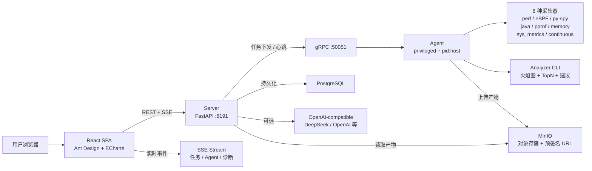

<p align="center">
  <h1 align="center">🔥 Mini-Drop</h1>
  <p align="center"><strong>轻量级 Linux 性能诊断平台</strong> — 火焰图 · eBPF · AI 归因 · 自然语言采集</p>
</p>

<p align="center">
  
  
  
  
</p>

---

## 目录

- [快速开始](#快速开始)
- [项目概览](#项目概览)
- [环境要求](#环境要求)
- [整体架构](#整体架构)
- [核心流程](#核心流程)
- [8 种采集器](#8-种采集器)
- [智能归因——5 层引擎](#智能归因5-层引擎)
- [任务状态机](#任务状态机)
- [Web 前端](#web-前端)
- [自然语言采集](#自然语言采集)
- [CLI 命令体系](#cli-命令体系)
- [API 速览](#api-速览)
- [部署与运维](#部署与运维)
- [安全设计](#安全设计)
- [AI Provider](#ai-provider)
- [开发命令](#开发命令)
- [仓库结构](#仓库结构)
- [设计原则](#设计原则)
- [关键决策与取舍](#关键决策与取舍)
- [更新日志](#更新日志)

---

## 快速开始

```bash
# 1. 克隆 + 配置
git clone https://github.com/jiangyulin1/mini-drop.git && cd mini-drop
cp .env.example .env

# 2. 启动全栈服务（PostgreSQL + MinIO + Server + Agent + Web）
docker compose up -d

# 3. 端到端演示：启动热点进程 → 创建采集任务 → 轮询完成 → 验证火焰图
bash demo/demo.sh

# 4. 浏览器打开 http://localhost 查看火焰图与诊断
```

> **纯净 Ubuntu 22.04 首次运行**：需要安装 `make` 和 Docker，见下方[环境要求](#环境要求)和[部署与运维](#部署与运维)章节。

**本地运行（无 Docker）：**

```bash
pip install -e ".[dev]"
python dev.py proto       # 编译 gRPC stub
python dev.py server      # 终端 1：FastAPI :8191 + gRPC :50051
python dev.py agent       # 终端 2：Agent 注册并心跳
python dev.py test        # 运行测试
```

---

## 项目概览

- **核心能力**：
  - Web UI 指定目标 PID、采样率、时长，通过 Server 下发任务给 Agent。
  - Agent 在目标主机上执行 perf / eBPF / py-spy / memory / continuous 采集，产物上传 MinIO。
  - Analyzer 将 perf.data 转为 D3 交互式火焰图 + ECharts TopN 热点排行。
  - 5 层智能归因引擎，LLM 辅助推理但受 Schema 硬约束，每条 claim 可追溯到原始证据。
  - 自然语言采集——用户输入"mysqld CPU 飙高"，系统自动匹配进程、选采集器、定参数。
- **运行形态**：React SPA 前端 + FastAPI 后端 + gRPC Agent 采集端 + PostgreSQL 持久化 + MinIO 对象存储。

## 关键设计亮点

- **分体部署架构**：Web/Server/DB/MinIO 跑在 Docker 里，Agent 裸机运行且需要 `privileged` + `pid:host`。权限隔离明确，Agent 可独立升级重启，不影响 Web 服务。
- **gRPC 契约优先**：5 个 `.proto` 文件定义全部通信接口，强类型编译期发现字段不匹配，二进制序列化比 JSON 小 3-5 倍。
- **采集器即插件**：所有采集器实现 `Collector(Protocol)` 协议——新增采集器只需实现 `collect(task) → CollectorResult`，Server 不绑定具体工具。
- **工具驱动的 AI 归因**：LLM 不直接输出自由文本。5 层管线——证据采集 → 候选生成 → 五维置信度校准 → LLM 推理（Few-Shot + Schema 硬约束 + 自修复）→ 修复计划。`rules.json` 外部化，不开 IDE 即可扩展诊断场景。
- **自然语言采集**：用户描述意图 → LLM function calling 解析 → `/proc` PID 匹配 → 参数 clamp 安全范围 → 自动创建任务。
- **白名单状态机**：`PENDING → RUNNING → UPLOADING → ANALYZING → DONE/FAILED`，每次迁移必写 `reason + actor` 到审计表，不允许跳状态，DONE/FAILED 终态不可回滚。
- **AI 开关分层降级**：`none` / `nlp-only` / `rca-only` / `full` 四级可切换，不配 API Key 时火焰图等核心功能不受影响，AI 自动降级为纯规则引擎。
- **eBPF 零侵入观测**：bpftrace 内核探针实时采集块设备 IO 延迟分布，不改代码、不重启服务。Web 端 ECharts histogram 绿→红渐变着色 + P50/P95/P99 分位估算。
- **交互式火焰图 + TopN 联动**：D3 火焰图支持缩放、搜索、hover 详情；点击 TopN 柱状图的函数名，火焰图自动高亮对应栈帧。

---

## 环境要求

| 项 | 要求 |
|------|------|
| **操作系统** | Ubuntu 22.04 / 20.04（其他 Linux 发行版需自行适配） |
| **Linux 内核** | 5.4+（eBPF 需要内核支持 BPF 特性） |
| **Docker** | Engine 20.10+ + Compose v2 |
| **make** | `sudo apt-get install -y make`（纯净 Ubuntu 需额外安装） |
| **内存** | 8 GB 以上（PostgreSQL + MinIO + Server + Web 合计约 2 GB） |
| **磁盘** | 20 GB 可用空间（Demo 产物约 500 MB） |
| **Python**（仅本地模式） | 3.9+ |
| **perf** | `linux-tools-$(uname -r)` — 用于 CPU 火焰图采集 |
| **bpftrace** | 0.14+ — 用于 eBPF IO 延迟采集 |
| **py-spy** | 0.3+ — 用于 Python 用户态采样 |

**纯净 Ubuntu 22.04 首次准备（以下命令全部复制执行即可）：**

```bash
# 安装 Docker（如未安装）
curl -fsSL https://get.docker.com | sudo sh
sudo usermod -aG docker $USER
# 登出后重新登录使组生效

# 安装 make
sudo apt-get update && sudo apt-get install -y make

# 安装 perf 和 bpftrace（可选，用于本地模式和 eBPF 演示）
sudo apt-get install -y linux-tools-$(uname -r) bpftrace
pip install py-spy

# 设置 perf 权限（容器内也需要宿主机允许）
sudo sh -c 'echo kernel.perf_event_paranoid=1 > /etc/sysctl.d/99-mini-drop.conf'
sudo sysctl -p /etc/sysctl.d/99-mini-drop.conf

# 克隆项目
git clone https://github.com/jiangyulin1/mini-drop.git && cd mini-drop
cp .env.example .env

# Docker 全栈启动
docker compose up -d

# 一键演示
bash demo/demo.sh
```

**Agent 容器权限：** perf 和 bpftrace 需要访问宿主机内核。Docker Compose 已配置 `privileged: true` + `pid: host` + `SYS_ADMIN` + `BPF` + `PERFMON`。

**bpftrace 兼容性说明：**
- 内核 5.15 上 bpftrace 0.14 不支持 `BEGIN` / `END` 特殊探针，Agent 采集脚本已改用 `interval:s:1` 定时打印替代，采集器端 SIGTERM 终止。
- 内核 5.15 使用 `blk_account_io_done` 替代 `blk_update_request`（后者在 5.15 的 kprobe 列表中不存在）。

---

## 整体架构



**核心端口：**

| 服务 | 端口 | 说明 |
|------|------|------|
| Web (nginx) | 80 | React SPA + API 反向代理 + SSE |
| Server HTTP | 8191 | FastAPI REST + Swagger `/docs` |
| Server gRPC | 50051 | Agent 通信 |
| PostgreSQL | 5432 | 任务/事件/审计/诊断 |
| MinIO API | 9000 | 对象存储 |
| MinIO Console | 9001 | 管理面板 |

### 架构决策

**为什么 gRPC？** Server ↔ Agent 使用 gRPC，5 个 `.proto` 文件定义全部通信接口，参考 DeepFlow `message/` 模式。强类型契约编译期发现字段不匹配，二进制序列化比 JSON 小 3-5 倍。Web ↔ Server 保留 REST/JSON——浏览器原生支持，易于 debug 和 curl 测试。

**为什么分体部署？** Agent 需要 `privileged` + `pid:host` + `BPF` 等内核级权限，与 Web/Server 混在一个 Docker 里权限模型很脏。分开后，Agent 可以独立升级、独立重启，不影响 Web 服务。生产环境中一台 Server 管理多台主机的 Agent 是标准拓扑。

**采集器统一接口。** 所有采集器实现 `Collector(Protocol)` 协议，Server 不绑定具体工具。新增采集器只需实现 `collect(task) → CollectorResult`。

**Analyzer 火焰图管线。** Agent 本地执行 `perf script → stackcollapse-perf.pl → flamegraph.pl` 流水线，产出 d3-flame-graph 所需的 `{name, value, children}` JSON 树（深度 >50 层截断），同时产出 SVG 降级备用。

**MINIO_PUBLIC_ENDPOINT 设计。** Docker 内部 MinIO 使用 `minio:9000`。Agent 通过 gRPC `FetchConfig` 获取 MinIO 地址时，Server 优先下发 `MINIO_PUBLIC_ENDPOINT`（外部可达地址），确保分体部署时 VM Agent 能直传产物到 Windows MinIO。浏览器预签名 URL 同理使用外部地址。

**SQLAlchemy + PostgreSQL 持久化。** 开发默认通过 `docker-compose.yml` 使用 PostgreSQL，`docker-compose.local.yml` 则切 SQLite 零配置。`expire_on_commit=False` 允许 session 关闭后继续读取数据。

---

## 核心流程

### 1) 端到端采集全链路

用户创建采集任务 → Server 写入 PostgreSQL 并置 `PENDING` → Agent 心跳拉取任务 → Agent 执行 perf/eBPF 采集 → 产物写入本地 `/tmp/mini-drop/{task_id}/` → Analyzer 将 `perf.data` 转为 `flamegraph.json` / `top.json` / `flamegraph.svg` → Agent 通知 Server（`NotifyResult` gRPC）→ Server 置 `UPLOADING` → Agent 上传产物到 MinIO → Server 置 `ANALYZING` → 规则引擎生成建议 → Server 置 `DONE`。

全程每一步迁移写入 `task_status_events` 表（`from_status → to_status, reason, actor`）。

### 2) eBPF IO 延迟采集链路

Agent 启动 `bpftrace io_latency.bt -o io_latency.txt` → 脚本挂载 `kprobe:blk_mq_start_request` 记录提交时间戳 → 挂载 `kprobe:blk_account_io_done` 计算 `(nsecs - start) / 1000` μs 延迟 → `interval:s:1` 定时打印 histogram → Agent SIGTERM 终止 bpftrace → 解析 regex 提取区间计数 → 输出 `ebpf_metrics.json`（`{io_latency_us: {"[32,64)": 9, ...}}`）→ Web 端 EBPFHistogram 组件渲染 ECharts 柱状图 + P50/P95/P99 分位。

### 3) 智能归因链路

触发诊断 → 证据采集层从产物提取结构化数据（TopN 热点、占比、采样数、栈深度、IO P99、RSS 趋势）→ 候选生成层匹配 `rules.json` 生成候选原因 → 置信度校准层五维打分 → 低于阈值剪枝 → 高置信度候选 + 原始证据发给 LLM → Few-Shot + JSON Schema 硬约束 + tool_choice → 输出校验（Schema + evidence_refs 完整性）→ 失败自动重试 2 次 → 修复计划（紧急/高/中三级风险 + 预估工作量）→ 用户标注反馈回写校准层权重。

### 4) 自然语言采集链路

用户输入 "mysqld CPU 飙高，帮我看看" → `POST /api/nlp/parse` → LLM function calling 解析意图（进程名 + 采集器类型 + 时长 + 采样率）→ 参数 clamp 到安全范围 → 前端展示确认界面 → 用户选择候选 PID → `POST /api/tasks` 创建任务 → 完成后 `POST /api/nlp/summarize` 生成自然语言总结 + 追问建议。

---

## 8 种采集器

| 采集器 | 类型 key | 采集工具 | 产出物 | Web 可视化 |
|--------|----------|----------|--------|------------|
| **perf CPU** | `perf_cpu` | perf record | flamegraph.json + SVG + top.json | D3 交互式火焰图 + ECharts TopN 联动 |
| **eBPF IO** | `ebpf_io` | bpftrace | IO 延迟 histogram JSON | ECharts 柱状图 + P50/P95/P99 |
| **py-spy** | `pyspy` | py-spy | 火焰图 SVG（--native 混合栈） | iframe SVG 渲染 |
| **Java** | `java_async` | async-profiler | HTML 火焰图 + JFR | iframe HTML 渲染 |
| **Go pprof** | `go_pprof` | pprof | pprof 原始数据 + SVG | SVG / Alert 提示 |
| **Memory** | `memory_smaps` | /proc/PID/smaps | 内存分段 + RSS 趋势 | ECharts 内存时序折线图 |
| **SysMetrics** | `sys_metrics` | /proc 多维 | CPU/线程/FD/网络/IO 时序 | ECharts 多维仪表盘 |
| **Continuous** | `continuous_perf` | perf record（周期） | 多窗口火焰图 + 汇总 | 窗口选择器 + 时间轴回放 |

所有采集器实现统一接口：

```python
class Collector(Protocol):
    def collect(self, task: CollectorTask) -> CollectorResult: ...
```

---

## 智能归因（5 层引擎）

```
┌──────────┐    ┌───────────┐    ┌──────────┐    ┌────────┐    ┌──────────┐
│ ① 证据   │ → │ ② 候选    │ → │ ③ 置信度 │ → │ ④ LLM  │ → │ ⑤ 修复   │
│ 采集     │    │ 生成      │    │ 校准     │    │ 推理   │    │ 计划     │
└──────────┘    └───────────┘    └──────────┘    └────────┘    └──────────┘
     ↑                                                            │
     └─────────────── ⑥ 反馈闭环 (用户标注修正权重) ─────────────┘
```

**逐层说明：**

| 层 | 职责 | 关键设计 |
|----|------|----------|
| **① 证据采集** | 从产物提取结构化证据——TopN 热点、栈深度、IO P99、RSS 趋势 | 不送整个火焰图 JSON 给 LLM，Token 太大且引入幻觉 |
| **② 候选生成** | 规则引擎匹配 `rules.json` 生成候选原因 | `rules.json` 外部化——运维团队不开 IDE 即可扩展诊断规则 |
| **③ 置信度校准** | 五维打分——正确性、完整性、可操作性、时效性、一致性 | 低于阈值剪枝，避免 AI 被低质量候选污染 |
| **④ LLM 推理** | 高置信度候选 + 原始证据发给 LLM，Few-Shot + JSON Schema 硬约束 | 核心原则：**不让 LLM 输出自由文本**。输出过 Schema 校验 + 引用完整性校验，失败自动重试 2 次 |
| **⑤ 修复计划** | claims 转分级修复建议——紧急/高/中三级，每条带预估工作量 | `requires_user_confirm` 标记需人工介入的风险操作 |
| **⑥ 反馈闭环** | 用户标注"准确/不准确"回写校准层权重矩阵 | 持续优化，不是一次性推理 |

**约束：** 每条 claim 必须带 `evidence_refs`；未配置 AI Key 时 → 规则引擎独立输出降级报告，火焰图等核心功能不受影响。

**如果重做：** 当前 5 层是线性管道（~8s 端到端）。若改为 DAG 并行模式（证据采集 + 候选生成同时启动，LLM 收到第一批证据就流式输出），预计降到 ~2s。另外 `rules.json` 目前是镜像固化的静态文件，可加 gRPC stream 推送通道——Server 更新规则后实时推给所有 Agent，本地热加载，不停机不重启。

### AI 集群诊断控制层

`/api/v1/diagnoses` 是独立于单个 Task 的可恢复诊断会话，覆盖自然语言意图、历史拓扑快照、候选假设、已有证据复用、受控探针、预算、R2 单次审批、证据血缘和等级置信报告。模型只负责意图理解；探针必须来自服务端注册表，R3 重启/迁移/配置修改不会自动执行。

当前轻量版由请求上下文提供服务实例与宿主机映射；没有可靠映射时进入 `NEEDS_SCOPE_CONFIRMATION`，不会向 Agent 扩散采集。后台扫描器使用持久化状态和短租约恢复会话，完成的探针通过 `diagnosis_step_id` 幂等关联，避免重复下发。

诊断结论包含 `cluster_assessment`，会把目标实例、同宿主机实例和一跳下游实例的系统指标放在同一证据平面比较，用于区分自身代码热点、噪声邻居、宿主机资源争抢和下游依赖问题。模糊输入不会被自动执行；系统只返回带审核注释的 `diagnostic_commands`，每条命令都有风险等级、`evidence_refs`、置信度和 `auto_execute=false`。

---

## 任务状态机

```
PENDING → RUNNING → UPLOADING → ANALYZING → DONE
   │         │          │            │
   └─────────┴──────────┴────────────┘→ FAILED
```

- 每次迁移必须提供非空 `reason`，写入 `task_status_events` 表（`from_status → to_status, reason, actor`）
- DONE / FAILED 是终态，拒绝再迁移
- 合法迁移路径由 `ALLOWED_TRANSITIONS` 白名单控制——不允许跳过中间状态
- 每个 Actor（web / server / agent / analyzer / ai）的迁移可审计
- Web 端 SSE 实时推送状态变更 + toast 通知

---

## Web 前端

| 页面 | 路由 | 功能 |
|------|------|------|
| 任务面板 | `/` | 统计卡片、NLP 输入、任务搜索/排序/删除、Agent 列表、SSE 实时通知 |
| 任务详情 | `/task/:id` | D3 交互式火焰图 + ECharts TopN 联动、eBPF IO Histogram、状态时间线、AI 归因 |
| AI 集群诊断 | `/ai-diagnosis` | 自然语言诊断、拓扑目标、假设、受控探针审批、证据血缘与等级置信报告 |
| 诊断历史 | `/diagnoses` | 全量诊断记录、置信度筛选、搜索过滤 |
| Agent 详情 | `/agent/:id` | 资源趋势折线图、采集能力标签、关联任务搜索 |
| 审计日志 | `/audit` | 事件筛选、自由搜索、时间倒序 |
| 系统设置 | `/settings` | AI 连通性测试、API Key 管理、服务健康 |

**技术栈：** React 18 + Ant Design 5 + d3-flame-graph + ECharts + Vite 5 + SSE + React Router 6

**交互设计：**
- **火焰图 + TopN 联动**：点击 ECharts 柱状图的函数名 → 通过 React ref 调用 `flameRef.current.search(funcName)` → D3 火焰图高亮匹配帧
- **暗色模式持久化**：localStorage 存 `mini-drop-theme`，切换即时生效
- **ErrorBoundary 全局捕获**：渲染异常降级为友好错误页（重试/回首页），不白屏
- **自动轮询 + SSE 双通道**：任务执行中 5s 轮询 + SSE 实时事件，确保数据不丢

---

## 自然语言采集

**设计思路：** 用户描述意图 → LLM function calling 解析 → `/proc` 进程名 PID 匹配（**不在 LLM 中做 PID 解析**——这是安全关键点）→ 参数 clamp 安全范围 → 前端确认 → 自动创建任务。

```
用户输入 "mysqld CPU 飙高，帮我看看"
  → POST /api/nlp/parse {query}
    → LLM function calling → {process_name: "mysqld", collector_type: "perf_cpu", duration_sec: 15, sample_rate: 49}
    → /proc 扫描匹配 mysqld → candidate_pids: [{pid: 1234, comm: "mysqld"}]
  → 前端展示确认界面 + PID 选择器
  → POST /api/tasks {name: "NLP: mysqld", agent_id: ..., target_pid: 1234, collector_type: "perf_cpu", ...}
  → 完成后 POST /api/nlp/summarize → AI 总结 + 追问建议
```

---

## CLI 命令体系

所有命令默认 JSON 输出，退出码语义明确（`diff-top` 超阈值返回 2，可做 CI 门禁）。

```bash
# 基础
micro-drop serve                    # 启动 Server
micro-drop agent                    # 启动 Agent
micro-drop version                  # 显示版本
micro-drop ai-config                # AI 配置 + feature flag 状态
micro-drop install-check            # 检查系统依赖和权限

# 采集 / 管理
micro-drop collect --agent agent_1 --pid 1234 --collector perf_cpu  # 远程采集
micro-drop status                   # Server/Agent/Task 概览
micro-drop task-cancel --task-id xxx # 取消任务
micro-drop watch-task --task-id xxx  # 轮询任务直到终态

# NLP / AI
micro-drop parse "nginx CPU 飙高"   # 自然语言解析
micro-drop summarize --top-json top.json           # TopN 总结
micro-drop diagnose-local --evidence evidence.json  # 离线 RCA
micro-drop feedback-stats           # 反馈准确率统计

# 差分 / CI
micro-drop diff-top --base before.json --head after.json --threshold 5
micro-drop ci-check --base before.json --head after.json   # CI 门禁 (exit 2)
micro-drop alert --top-json top.json --hotspot-threshold 70 # 热点告警 (exit 2)

# 本地采集（无需 Server）
micro-drop perf-top --pid 1234 --duration 10  # 本地 perf TopN

# 存储 / 报告
micro-drop storage-ls                          # 列举 MinIO 产物
micro-drop storage-prune --older-than-days 30  # 清理旧产物（dry-run）
micro-drop report --top-json top.json --format markdown --output report.md

# Shell 补全
micro-drop completion --shell bash
# eval "$(micro-drop completion --shell bash)"
```

---

## API 速览

### 任务

```bash
POST   /api/tasks                          # 创建采集任务
GET    /api/tasks?search=&sort_by=&sort_order=  # 列表（搜索+排序+分页）
GET    /api/tasks/{id}                     # 详情
DELETE /api/tasks/{id}                     # 删除（仅终态 + 级联删除关联数据）
GET    /api/tasks/{id}/events              # 状态迁移链
GET    /api/tasks/{id}/artifacts           # 产物列表
GET    /api/tasks/{id}/artifacts/{type}/content  # 产物内容
POST   /api/tasks/{id}/diagnose            # AI 诊断
GET    /api/tasks/{id}/diagnoses           # 诊断历史
```

### 诊断 + Agent + NLP

```bash
GET    /api/diagnoses/{id}                 # 诊断详情（报告+工具+修复计划）
POST   /api/diagnoses/{id}/feedback        # 提交反馈
POST   /api/v1/diagnoses                    # 创建 AI 集群诊断会话
GET    /api/v1/diagnoses/{id}               # 会话详情并推进可恢复工作流
POST   /api/v1/diagnoses/{id}/approvals     # R2 探针单次批准/拒绝
GET    /api/v1/probes                       # 受控探针注册表
GET    /api/agents                         # Agent 列表（含离线检测）
GET    /api/audit-logs                     # 审计日志
POST   /api/nlp/parse                      # 自然语言解析
POST   /api/nlp/summarize                  # 任务结果 AI 总结
GET    /api/storage/presign?key=...        # MinIO 预签名 URL
GET    /api/metrics                        # Prometheus 指标
GET    /api/events/stream                  # SSE 实时事件流
GET    /api/healthz                        # 健康检查（含 DB + 存储检测）
```

---

## 部署与运维

### Docker 部署

```bash
git clone https://github.com/jiangyulin1/mini-drop.git && cd mini-drop
cp .env.example .env
docker compose up -d
```

### 分体部署（推荐）

```
Windows Docker Desktop (Server+Web+PG+MinIO) ← gRPC → Linux VM (Agent 裸机)
```

```bash
# Windows: 只启动服务端（不含 Agent）
docker compose up -d

# VM: 裸机启动 Agent 指向 Windows
export AGENT_GRPC_ADDR=172.17.144.1:50051
export AGENT_ID=agent_vm_demo
export AGENT_UPLOAD_ARTIFACTS=1
export MINIO_ENDPOINT=172.17.144.1:9000
sudo python -m agent.mini_drop_agent.main  # root：bpftrace 需要
```

### 离线 / 本地 Docker（SQLite，无需拉取外部镜像）

```bash
npm --prefix web run build
docker compose -f docker-compose.yml -f docker-compose.local.yml up -d --build server agent web
```

### 一键演示

```bash
# 前提：docker compose up -d 已运行
bash demo/demo.sh

# 快速过场（每个场景 5 秒）
DEMO_QUICK=1 bash demo/demo.sh

# 只跑 CPU + 内存场景
DEMO_SCENES=cpu,memory bash demo/demo.sh

# 分体部署模式（API 在远程）
SPLIT_HOST=172.17.144.1 bash demo/demo.sh
```

### 演示脚本说明

| 脚本 | 用途 |
|------|------|
| `demo/demo.sh` | 主演示：6 个场景，自动检测 Docker/本地模式 |
| `demo/vm_test_targets.py` | 15 种负载场景生成器 |
| `demo/cpu_hotspot.py` | 简单热点进程（fib/sort/json 每 60s 循环切换） |
| `demo/test_runner.py` | 自动化 E2E 测试套件（16 场景 + 报告） |
| `demo/vm_deploy.sh` | 环境一键部署（依赖安装 + 编译 + 测试） |

### VM 端 perf 权限

```bash
sudo sysctl -w kernel.perf_event_paranoid=1
```

### MinIO 公网端点

Docker 内 MinIO 使用 `minio:9000`。浏览器预签名 URL 需通过宿主机端口访问：

```bash
# 本地
MINIO_PUBLIC_ENDPOINT=localhost:9000

# 分体部署（VM Agent 需要通过外部地址上传产物）
MINIO_PUBLIC_ENDPOINT=172.17.144.1:9000
```

---

## 安全设计

| 层次 | 措施 |
|------|------|
| **HTTP API** | Bearer / X-API-Key / query token 三通道认证 |
| **gRPC** | Token 认证拦截器 + 可选 TLS |
| **产物读取** | 沙箱限制在 `MINI_DROP_ARTIFACT_ROOT` 内 |
| **预签名 URL** | 有效期可配，限制 `tasks/` 前缀 |
| **Agent 保护** | 拒绝自剖析（target_pid == self PID 时拒绝）；参数 clamp 防资源耗尽 |
| **AI 诊断控制层** | Pydantic 拒绝未知字段、服务范围白名单、固定探针注册表、R2 人工审批、主机/实例/并发/时长预算、多机证据对比、命令仅建议不执行 |
| **密钥管理** | `.env` 已 gitignore，`.env.example` 仅模板占位符 |
| **Nginx** | CSP / HSTS / X-Frame-Options / 速率限制 |

**生产开启认证：**

```bash
MINI_DROP_API_KEY=$(openssl rand -hex 32)
MINI_DROP_GRPC_TOKEN=$(openssl rand -hex 32)
MINI_DROP_API_AUTH_ENABLED=1
MINI_DROP_GRPC_AUTH_ENABLED=1
```

---

## AI Provider

兼容任意 OpenAI-style `/v1/chat/completions` 接口：

```bash
export MINI_DROP_AI_ENABLED=full
export MINI_DROP_AI_PROVIDER=deepseek
export MINI_DROP_AI_BASE_URL=https://api.deepseek.com
export MINI_DROP_AI_API_KEY=sk-xxx
export MINI_DROP_AI_MODEL=deepseek-chat
```

**开关层级：**

```
MINI_DROP_AI_ENABLED=none      → nlp=off, rca=off, summarize=off
MINI_DROP_AI_ENABLED=nlp-only  → nlp=on,  rca=off, summarize=off
MINI_DROP_AI_ENABLED=rca-only  → nlp=off, rca=on,  summarize=off
MINI_DROP_AI_ENABLED=full      → nlp=on,  rca=on,  summarize=on
```

不配 API Key 时核心采集/火焰图功能不受影响，AI 功能自动降级为规则引擎。

---

## 开发命令

```bash
# Makefile（Linux / macOS / Git Bash）
make proto          # 编译 gRPC stub
make server         # 启动 Server
make agent          # 启动 Agent
make test           # 运行测试
make lint           # 语法检查 + ruff + mypy
make fmt            # ruff format
make demo           # bash demo/demo.sh

# dev.py（跨平台）
python dev.py proto
python dev.py server
python dev.py agent
python dev.py test
python dev.py lint
python dev.py install              # pip install -e ".[dev]"

# 完整开发流程
pip install -e ".[dev]"
python dev.py proto
python dev.py server      # 终端 1
python dev.py agent       # 终端 2
python dev.py test
npm --prefix web run dev  # Vite HMR :5173（可选）
```

---

## 仓库结构

```
mini-drop/
├── server/app/           FastAPI + gRPC + RCA + NLP + Prometheus
│   ├── main.py           FastAPI 入口 + 全量 API 路由
│   ├── grpc_server.py    gRPC 后台线程启动（共进程）
│   ├── grpc_services/    4 个 gRPC 服务实现（Init/HealthCheck/Hotmethod/Control）
│   ├── nlp/              自然语言意图解析 + 进程 PID 匹配 + AI 总结 + 追问
│   ├── rca/              5 层归因引擎（evidence → candidates → calibrator → LLM → repair）
│   ├── diagnosis/        集群诊断会话（intent → topology → hypotheses → probes → evidence）
│   ├── models.py         SQLAlchemy ORM 模型
│   ├── sql_repository.py 数据库仓储层（读写分离 + TTL 缓存 + 级联删除）
│   ├── repository.py     内存仓储层（兼容旧版）
│   ├── state_machine.py  白名单状态机 + 迁移校验
│   └── schemas.py        Pydantic 请求/响应模型 + 参数边界常量
├── agent/mini_drop_agent/ Agent 采集端（gRPC 长连接 + 指数退避重试）
│   ├── main.py           Agent 主循环（注册 → 心跳 → 拉任务 → 执行 → 上报）
│   ├── collectors/       8 种采集器（perf/eBPF/py-spy/java/pprof/memory/sys/continuous）
│   │   └── scripts/      bpftrace 内核探针脚本
│   ├── config.py         环境变量加载 + 参数边界校验
│   └── connection.py     gRPC 连接管理 + 认证拦截器 + 重试逻辑
├── analyzer/             perf.data → stackcollapse → flamegraph JSON 树 + TopN + SVG
├── web/                  React 18 + Ant Design 5 + d3-flame-graph + ECharts
│   ├── src/pages/        Dashboard / TaskResult / AgentDetail / AuditLogs / Settings / DiagnosisHistory
│   └── src/components/   FlamegraphViewer / TopNChart / EBPFHistogram / NLPTaskInput / ErrorBoundary
├── proto/                5 个 gRPC 契约文件（common/init/healthcheck/hotmethod/control）
├── demo/                 演示脚本 & 15 种负载场景生成器
├── deploy/               Dockerfiles + nginx 配置
├── tests/                33 个测试文件（单元 + 集成 + E2E）
└── docs/                 设计文档 + 智能归因评测报告
```

---

## 设计原则

- **gRPC 契约优先** — proto 是 Server ↔ Agent 唯一契约来源
- **采集器即插件** — 统一 `Collector(Protocol)` 接口，Server 不绑定工具
- **LLM 工具约束** — AI 只能调预定义 tool，不做自由决策；输出过 Schema + 引用校验
- **归因可追溯** — 每条 claim 带 `evidence_refs`，指向原始证据字段
- **多机因果区分** — 目标实例、同宿主实例和下游实例一起比较，避免把最先告警节点误判为根因
- **人机协同执行** — 模糊自然语言只生成带注释的可审核命令，高风险变更始终人工确认
- **状态机驱动** — `ALLOWED_TRANSITIONS` 白名单，每步迁移必带 `reason` + `actor`
- **降级友好** — AI 不可用时核心功能不受影响
- **防御性编程** — 路径沙箱、参数 clamp、预签名白名单、拒绝自剖析
- **密钥不入仓库** — `.env` 已 gitignore，`.env.example` 仅模板占位符

---

## 关键决策与取舍

### 为什么 Analyzer 跑在 Agent 侧而非 Server 侧？

Agent 本地执行 `perf script → stackcollapse → flamegraph` 流水线。火焰图 JSON 树通常只有几 KB 到几十 KB，比原始 `perf.data`（数百 KB 到数 MB）小得多。上传 JSON 而非原始数据到 MinIO，节省带宽和存储。

### 为什么 D3 火焰图而不是 ECharts 热力图？

D3 火焰图天然支持帧级别的缩放、搜索、hover 详情，这是性能分析的核心交互。ECharts 更适合 TopN 柱状图这种标准图表。两者各自发挥所长，通过 React ref 联动。

### 为什么 bpftrace 而非 libbpf / BCC？

bpftrace 对演示场景足够——Shell 一行命令即可挂载内核探针。libbpf 更适合生产环境（CO-RE 可移植、无运行时依赖），但工程复杂度显著更高。当前阶段 bpftrace 是合理的选择，未来可升级到 libbpf。

### 为什么 AI 不直接接入火焰图全量数据？

火焰图 JSON 树可能有数千个节点，直接送 LLM Token 消耗巨大且容易产生幻觉。证据采集层提取 TopN + 结构化指标，既能被规则引擎处理，也能高效喂给 LLM。这是"人肉分析→结构化证据→LLM 推理"的工程化思路。

---

## 更新日志

### 2026-06-21 — Web 前端业务逻辑完善

- **Dashboard 任务管理**：新增搜索（按名称/ID 模糊匹配）、排序（按字段 + 升/降序）、删除（确认弹窗 + 进行中任务保护 + 级联删除事件/产物/诊断/审计日志）。
- **AuditLogs**：新增事件类型下拉筛选、自由文本搜索、时间倒序、复制 task_id。
- **Settings**：新增内联 API Key 输入框 + 保存/清除按钮、AI 连通性测试按钮。
- **AgentDetail**：新增关联任务搜索过滤、ECharts 实例正确 dispose 重建修复内存泄漏。
- **NLPTaskInput**：Agent 选择优先匹配对应采集器能力的在线 Agent。
- **ErrorBoundary**：全局渲染异常捕获，降级为友好错误页（重试/回首页），不白屏。
- **EBPFHistogram**：eBPF IO 延迟分布 ECharts 柱状图——绿→红渐变着色、P50/P95/P99 分位估算、hint 提示。满足 题目要求 "eBPF 必须在 Web 上有自己的可视化形态"。

### 2026-06-21 — eBPF bpftrace 兼容性修复

- **io_latency.bt**：移除 `BEGIN`/`END` 特殊探针（bpftrace 0.14 + 内核 5.15 无法解析符号），改用 `interval:s:1` 定时打印 histogram。`blk_update_request` → `blk_account_io_done`（内核 5.15 兼容）。
- **ebpf.py**：退出码放宽（`-9`/`-15`/`255` 均视为信号终止），interval 模式解析器取最后一次 histogram 值。
- **验证**：Linux VM 裸机 root Agent，eBPF IO 延迟采集 DONE，163 samples，7 个延迟区间 [32μs ~ 4ms]。

### 2026-06-21 — 分体部署支持

- **init_service.py**：`FetchConfig` 下发 `MINIO_PUBLIC_ENDPOINT` 而非 Docker 内部地址 `minio:9000`，修复分体部署下 VM Agent 产物上传持续失败。
- **demo.sh**：新增 `SPLIT_HOST` 环境变量支持远程 API 模式。
### 更早版本

- **2026-06-20** — 演示体系完善、`make demo` 6 场景一键跑通。
- **2026-06-18** — SSE 实时事件流、NLP 自然语言采集。
- **2026-06-17** — 5 层智能归因引擎（DeepSeek + Few-Shot + 自修复）、Continuous Profiling。
- **2026-06-16** — eBPF IO 延迟 + py-spy Python 采样 + 8 种采集器完备。
- **2026-06-15** — D3 交互式火焰图 + ECharts TopN 联动、Web 前后端打通。
- **2026-06-14** — gRPC 四项服务 + Agent 主循环 + perf CPU 采集器。
- **2026-06-13** — 项目骨架：Proto 契约 + 状态机 + FastAPI + SQLAlchemy。
