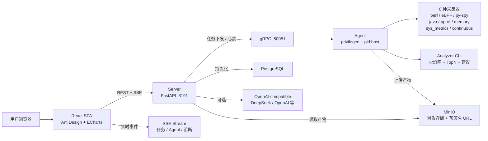

<p align="center">
  <h1 align="center">🔥 Mini-Drop</h1>
  <p align="center"><strong>轻量级 Linux 性能诊断平台</strong> — 火焰图 · eBPF · AI 归因 · 自然语言采集</p>
</p>

<p align="center">
  
  
  
  
</p>

---

## 目录

- [快速开始](#快速开始)
- [环境要求](#环境要求)
- [架构总览](#架构总览)
- [8 种采集器](#8-种采集器)
- [智能归因（5 层引擎）](#智能归因5-层引擎)
- [任务状态机](#任务状态机)
- [Web 前端](#web-前端)
- [CLI 命令](#cli-命令)
- [API 速览](#api-速览)
- [部署与运维](#部署与运维)
- [安全](#安全)
- [AI Provider](#ai-provider)
- [开发命令](#开发命令)
- [仓库结构](#仓库结构)
- [设计原则](#设计原则)

---

## 快速开始

```bash
# 1. 克隆 + 配置
git clone https://github.com/jiangyulin1/mini-drop.git && cd mini-drop
cp .env.example .env

# 2. 启动全栈服务（PostgreSQL + MinIO + Server + Agent + Web）
docker compose up -d

# 3. 端到端演示：启动热点进程 → 创建采集任务 → 轮询完成 → 验证火焰图
bash demo/demo.sh

# 4. 浏览器打开 http://localhost 查看火焰图与诊断
```

> **纯净 Ubuntu 22.04 首次运行**：需要安装 `make` 和 Docker，
> 见下方[环境要求](#环境要求)和[部署与运维](#部署与运维)章节。

**本地运行（无 Docker）：**

```bash
pip install -e ".[dev]"
python dev.py proto       # 编译 gRPC stub
python dev.py server      # 终端 1：FastAPI :8191 + gRPC :50051
python dev.py agent       # 终端 2：Agent 注册并心跳
python dev.py test        # 运行测试
```

---

## 环境要求

| 项 | 要求 |
|------|------|
| **操作系统** | Ubuntu 22.04 / 20.04（其他 Linux 发行版需自行适配） |
| **Linux 内核** | 5.4+（eBPF 需要内核支持 BPF 特性） |
| **Docker** | Engine 20.10+ + Compose v2 |
| **make** | `sudo apt-get install -y make`（纯净 Ubuntu 需额外安装） |
| **内存** | 8 GB 以上（PostgreSQL + MinIO + Server + Web 合计约 2 GB） |
| **磁盘** | 20 GB 可用空间（Demo 产物约 500 MB） |
| **Python**（仅本地模式） | 3.9+ |
| **perf** | `linux-tools-$(uname -r)` — 用于 CPU 火焰图采集 |
| **bpftrace** | 0.14+ — 用于 eBPF IO 延迟采集 |
| **py-spy** | 0.3+ — 用于 Python 用户态采样 |

**纯净 Ubuntu 22.04 首次准备（以下命令全部复制执行即可）：**

```bash
# 安装 Docker（如未安装）
curl -fsSL https://get.docker.com | sudo sh
sudo usermod -aG docker $USER
# 登出后重新登录使组生效

# 安装 make
sudo apt-get update && sudo apt-get install -y make

# 安装 perf 和 bpftrace（可选，用于本地模式和 eBPF 演示）
sudo apt-get install -y linux-tools-$(uname -r) bpftrace
pip install py-spy

# 设置 perf 权限（容器内也需要宿主机允许）
sudo sh -c 'echo kernel.perf_event_paranoid=1 > /etc/sysctl.d/99-mini-drop.conf'
sudo sysctl -p /etc/sysctl.d/99-mini-drop.conf

# 克隆项目
git clone https://github.com/jiangyulin1/mini-drop.git && cd mini-drop
cp .env.example .env

# Docker 全栈启动
docker compose up -d

# 一键演示
bash demo/demo.sh
```

**Agent 容器权限：** perf 和 bpftrace 需要访问宿主机内核。Docker Compose 已配置 `privileged: true` + `pid: host` + `SYS_ADMIN` + `BPF` + `PERFMON`。

---

## 架构总览



**核心端口：**

| 服务 | 端口 | 说明 |
|------|------|------|
| Web (nginx) | 80 | React SPA + API 反向代理 + SSE |
| Server HTTP | 8191 | FastAPI REST + Swagger `/docs` |
| Server gRPC | 50051 | Agent 通信 |
| PostgreSQL | 5432 | 任务/事件/审计/诊断 |
| MinIO API | 9000 | 对象存储 |
| MinIO Console | 9001 | 管理面板 |

### 设计思路

**gRPC + Protobuf 契约优先。** Server ↔ Agent 使用 gRPC，5 个 `.proto` 文件定义全部通信接口，参考 DeepFlow `message/` 模式。强类型契约编译期发现字段不匹配，二进制序列化比 JSON 小 3-5 倍。Web ↔ Server 保留 REST/JSON——浏览器原生支持，易于 debug 和 curl 测试。

**采集器统一接口。** 所有采集器实现 `Collector(Protocol)` 协议，Server 不绑定具体工具。新增采集器只需实现 `collect(task) → CollectorResult`。

**Analyzer 火焰图管线。** Agent 本地执行 `perf script → stackcollapse-perf.pl → flamegraph.pl` 流水线，产出 d3-flame-graph 所需的 `{name, value, children}` JSON 树（深度 >50 层截断），同时产出 SVG 降级备用。

**工具驱动的智能归因。** LLM 不直接输出自由文本。5 层引擎——证据采集、候选生成（`rules.json` 外部化）、五维置信度校准、LLM 推理（Few-Shot + Schema 硬约束 + 自修复）、修复计划（三级风险）——输出可追溯。每条 claim 带 `evidence_refs`。

**自然语言采集。** 用户描述 → LLM function calling 解析意图 → `/proc` 进程名 PID 匹配（不做在 LLM 中）→ 参数 clamp 到安全范围 → 创建任务。

**SQLAlchemy + SQLite/PostgreSQL 双后端。** 开发默认 SQLite 零配置（`docker-compose.local.yml`），生产通过 `DATABASE_URL` 切换 PostgreSQL。`expire_on_commit=False` 允许 session 关闭后继续读取数据。

---

## 8 种采集器

| 采集器 | 类型 key | 采集工具 | 产出物 |
|--------|----------|----------|--------|
| **perf CPU** | `perf_cpu` | perf record | flamegraph.json + SVG + top.json |
| **eBPF IO** | `ebpf_io` | bpftrace | IO 延迟 histogram JSON |
| **py-spy** | `pyspy` | py-spy | 火焰图 SVG（--native 混合栈） |
| **Java** | `java_async` | async-profiler | HTML 火焰图 + JFR |
| **Go pprof** | `go_pprof` | pprof | pprof 原始数据 + SVG |
| **Memory** | `memory_smaps` | /proc/PID/smaps | 内存分段 + RSS 趋势 |
| **SysMetrics** | `sys_metrics` | /proc 多维 | CPU/线程/FD/网络/IO 时序 |
| **Continuous** | `continuous_perf` | perf record（周期） | 多窗口火焰图 + 汇总 |

所有采集器实现统一接口：

```python
class Collector(Protocol):
    def collect(self, task: CollectorTask) -> CollectorResult: ...
```

---

## 智能归因（5 层引擎）

```
┌──────────┐    ┌───────────┐    ┌──────────┐    ┌────────┐    ┌──────────┐
│ ① 证据   │ → │ ② 候选    │ → │ ③ 置信度 │ → │ ④ LLM  │ → │ ⑤ 修复   │
│ 采集     │    │ 生成      │    │ 校准     │    │ 推理   │    │ 计划     │
└──────────┘    └───────────┘    └──────────┘    └────────┘    └──────────┘
     ↑                                                            │
     └─────────────── ⑥ 反馈闭环 (用户标注修正权重) ─────────────┘
```

**约束：** 每条 claim 必须带 `evidence_refs`；LLM 不能自由发挥，输出过 Schema + 引用完整性校验，失败自动重试（最多 2 次自修复）。未配置 AI Key 时 → 规则引擎独立输出降级报告。

---

## 任务状态机

```
PENDING → RUNNING → UPLOADING → ANALYZING → DONE
   │         │          │            │
   └─────────┴──────────┴────────────┘→ FAILED
```

- 每次迁移必须提供非空 `reason`，写入 `task_status_events` 表
- DONE / FAILED 是终态，拒绝再迁移
- 合法迁移路径由 `ALLOWED_TRANSITIONS` 白名单控制
- 每个 Actor（web/server/agent/analyzer/ai）的迁移可审计

---

## Web 前端

| 页面 | 路由 | 功能 |
|------|------|------|
| 任务面板 | `/` | 统计卡片、NLP 输入、任务/Agent 列表、SSE toast 通知 |
| 任务详情 | `/task/:id` | d3 交互式火焰图 + ECharts TopN 联动、状态时间线、AI 归因 |
| 诊断历史 | `/diagnoses` | 全量诊断记录、置信度筛选 |
| Agent 详情 | `/agent/:id` | 资源趋势、采集能力标签、关联任务 |
| 审计日志 | `/audit` | 系统审计事件分页 |
| 系统设置 | `/settings` | AI/ChatOps/服务健康配置 |

**技术栈：** React 18 + Ant Design 5 + d3-flame-graph + ECharts + Vite 5

---

## CLI 命令

所有命令默认 JSON 输出，退出码语义明确（`diff-top` 超阈值返回 2，可做 CI 门禁）。

```bash
# 基础
micro-drop serve                    # 启动 Server
micro-drop agent                    # 启动 Agent
micro-drop version                  # 显示版本
micro-drop ai-config                # AI 配置 + feature flag 状态
micro-drop install-check            # 检查系统依赖和权限

# 采集 / 管理
micro-drop collect --agent agent_1 --pid 1234 --collector perf_cpu  # 远程采集
micro-drop status                   # Server/Agent/Task 概览
micro-drop task-cancel --task-id xxx # 取消任务
micro-drop watch-task --task-id xxx  # 轮询任务直到终态

# NLP / AI
micro-drop parse "nginx CPU 飙高"   # 自然语言解析
micro-drop summarize --top-json top.json           # TopN 总结
micro-drop diagnose-local --evidence evidence.json  # 离线 RCA
micro-drop feedback-stats           # 反馈准确率统计

# 差分 / CI
micro-drop diff-top --base before.json --head after.json --threshold 5
micro-drop ci-check --base before.json --head after.json   # CI 门禁 (exit 2)
micro-drop alert --top-json top.json --hotspot-threshold 70 # 热点告警 (exit 2)

# 本地采集（无需 Server）
micro-drop perf-top --pid 1234 --duration 10  # 本地 perf TopN

# 存储 / 报告
micro-drop storage-ls                          # 列举 MinIO 产物
micro-drop storage-prune --older-than-days 30  # 清理旧产物（dry-run）
micro-drop report --top-json top.json --format markdown --output report.md

# Shell 补全
micro-drop completion --shell bash
# eval "$(micro-drop completion --shell bash)"
```

---

## API 速览

### 任务

```bash
POST   /api/tasks                          # 创建采集任务
GET    /api/tasks                          # 列表
GET    /api/tasks/{id}                     # 详情
GET    /api/tasks/{id}/events              # 状态迁移链
GET    /api/tasks/{id}/artifacts           # 产物列表
GET    /api/tasks/{id}/artifacts/{type}/content  # 产物内容
POST   /api/tasks/{id}/diagnose            # AI 诊断
GET    /api/tasks/{id}/diagnoses           # 诊断历史
```

### 诊断 + Agent + NLP

```bash
GET    /api/diagnoses/{id}                 # 诊断详情（报告+工具+修复计划）
POST   /api/diagnoses/{id}/feedback        # 提交反馈
GET    /api/agents                         # Agent 列表（含离线检测）
GET    /api/audit-logs                     # 审计日志
POST   /api/nlp/parse                      # 自然语言解析
POST   /api/nlp/summarize                  # 任务结果 AI 总结
GET    /api/storage/presign?key=...        # MinIO 预签名 URL
GET    /api/metrics                        # Prometheus 指标
GET    /api/events/stream                  # SSE 实时事件流
```

---

## 部署与运维

### Docker 部署

```bash
git clone https://github.com/jiangyulin1/mini-drop.git && cd mini-drop
cp .env.example .env
docker compose up -d
```

### 离线 / 本地 Docker（SQLite，无需拉取外部镜像）

```bash
npm --prefix web run build
docker compose -f docker-compose.yml -f docker-compose.local.yml up -d --build server agent web
```

### 一键演示

```bash
# 前提：docker compose up -d 已运行
bash demo/demo.sh

# 快速过场（每个场景 5 秒）
DEMO_QUICK=1 bash demo/demo.sh

# 只跑 CPU + 内存场景
DEMO_SCENES=cpu,memory bash demo/demo.sh
```

### 演示脚本说明

| 脚本 | 用途 |
|------|------|
| `demo/demo.sh` | 主演示：6 个场景，自动检测 Docker/本地模式 |
| `demo/vm_test_targets.py` | 15 种负载场景生成器 |
| `demo/cpu_hotspot.py` | 简单热点进程（fib/sort/json 循环） |
| `demo/test_runner.py` | 自动化 E2E 测试套件（16 场景 + 报告） |
| `demo/vm_deploy.sh` | 环境一键部署（依赖安装 + 编译 + 测试） |

### VM 端 perf 权限

```bash
sudo sysctl -w kernel.perf_event_paranoid=1
```

### MinIO 公网端点

Docker 内 MinIO 使用 `minio:9000`。浏览器预签名 URL 需通过宿主机端口访问：

```bash
# 本地
MINIO_PUBLIC_ENDPOINT=localhost:9000

# 远程 VM
MINIO_PUBLIC_ENDPOINT=172.24.188.165:9000
```

---

## 安全

| 层次 | 措施 |
|------|------|
| **HTTP API** | Bearer / X-API-Key / query token 三通道认证 |
| **gRPC** | Token 认证拦截器 + 可选 TLS |
| **产物读取** | 沙箱限制在 `MINI_DROP_ARTIFACT_ROOT` 内 |
| **预签名 URL** | 有效期可配，限制 `tasks/` 前缀 |
| **Agent 保护** | 拒绝自剖析（target_pid == self PID 时拒绝） |
| **密钥管理** | `.env` 已 gitignore，`docker compose` 从 `.env.example` 读取 |
| **Nginx** | CSP / HSTS / X-Frame-Options / 速率限制 |

**生产开启认证：**

```bash
MINI_DROP_API_KEY=$(openssl rand -hex 32)
MINI_DROP_GRPC_TOKEN=$(openssl rand -hex 32)
MINI_DROP_API_AUTH_ENABLED=1
MINI_DROP_GRPC_AUTH_ENABLED=1
```

---

## AI Provider

兼容任意 OpenAI-style `/v1/chat/completions` 接口：

```bash
export MINI_DROP_AI_ENABLED=full
export MINI_DROP_AI_PROVIDER=deepseek
export MINI_DROP_AI_BASE_URL=https://api.deepseek.com
export MINI_DROP_AI_API_KEY=sk-xxx
export MINI_DROP_AI_MODEL=deepseek-chat
```

开关层级：

```
MINI_DROP_AI_ENABLED=none      → nlp=off, rca=off, summarize=off
MINI_DROP_AI_ENABLED=nlp-only  → nlp=on,  rca=off, summarize=off
MINI_DROP_AI_ENABLED=rca-only  → nlp=off, rca=on,  summarize=off
MINI_DROP_AI_ENABLED=full      → nlp=on,  rca=on,  summarize=on
```

未配置 API Key 时核心采集/火焰图功能不受影响，AI 功能自动降级为规则引擎。

---

## 开发命令

```bash
# Makefile（Linux / macOS / Git Bash）
make proto          # 编译 gRPC stub
make server         # 启动 Server
make agent          # 启动 Agent
make test           # 运行测试
make lint           # 语法检查 + ruff + mypy
make fmt            # ruff format
make demo           # bash demo/demo.sh

# dev.py（跨平台）
python dev.py proto
python dev.py server
python dev.py agent
python dev.py test
python dev.py lint
python dev.py install              # pip install -e ".[dev]"

# 完整开发流程
pip install -e ".[dev]"
python dev.py proto
python dev.py server      # 终端 1
python dev.py agent       # 终端 2
python dev.py test
npm --prefix web run dev  # Vite HMR :5173（可选）
```

---

## 仓库结构

```
mini-drop/
├── server/app/           FastAPI + gRPC + RCA + NLP + ChatOps + Prometheus
│   ├── grpc_services/    4 个 gRPC 服务实现
│   ├── nlp/              意图解析 + 进程发现 + AI 总结
│   ├── rca/              5 层归因引擎（evidence → candidates → calibrator → LLM → repair）
│   └── chatops/          5 平台 IM 通知（钉钉/飞书/企微/Slack/QQ）
├── agent/mini_drop_agent/  Agent 采集端（gRPC 长连接 + 8 种采集器）
│   └── collectors/       perf / eBPF / py-spy / java / pprof / memory / sys_metrics / continuous
├── analyzer/             perf script → 火焰图 JSON 树 + TopN + SVG
├── web/                  React 18 + Ant Design 5 + d3-flame-graph + ECharts
├── proto/                5 个 gRPC 契约文件
├── demo/                 演示脚本 & 负载场景
├── deploy/               Dockerfiles + nginx 配置
├── tests/                28 个测试文件（含 E2E）
└── docs/                 设计文档 + 归因评测报告
```

---

## 设计原则

- **gRPC 契约优先** — proto 是 Server ↔ Agent 唯一契约来源
- **采集器即插件** — 统一 `Collector(Protocol)` 接口，Server 不绑定工具
- **LLM 工具约束** — AI 只能调预定义 tool，不做自由决策；输出过 Schema + 引用校验
- **归因可追溯** — 每条 claim 带 `evidence_refs`，指向原始证据字段
- **状态机驱动** — `ALLOWED_TRANSITIONS` 白名单，每步迁移必带 `reason`
- **降级友好** — AI 不可用时核心功能不受影响
- **防御性编程** — 路径沙箱、参数 clamp、预签名白名单、拒绝自剖析
- **密钥不入仓库** — `.env` 已 gitignore，`.env.example` 仅模板占位符
