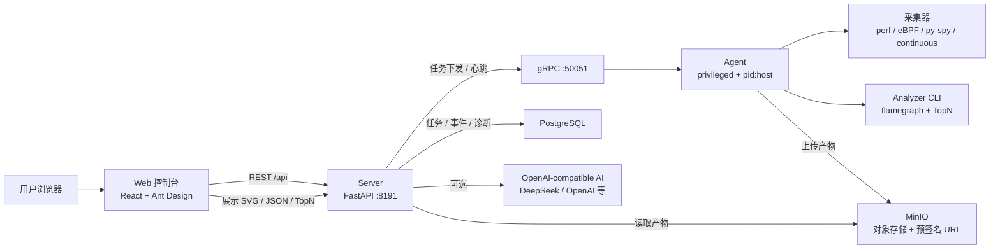

# Mini-Drop

面向 Linux 主机的轻量级性能诊断平台，支持 CPU 火焰图、eBPF IO 延迟观测、
Python 用户态采样、持续 Profiling、AI 智能归因和自然语言采集。

## 快速开始

```bash
pip install micro-drop
micro-drop serve
# 另一个终端或生产服务器上
micro-drop agent
```

源码部署：
```bash
git clone https://github.com/jiangyulin1/mini-drop.git
cd mini-drop
cp .env.example .env
docker compose up -d
# 浏览器打开 http://localhost
```

虚拟机演示：

```bash
# .env 中按你的 VM IP 配置
MINIO_PUBLIC_ENDPOINT=172.24.188.165:9000

docker compose up -d
```

演示：
```bash
make demo
```

验收：
```bash
make test
make coverage    # 需要先安装 dev 依赖: pip install -e ".[dev]"
npm --prefix web run build
```

## 测试入口与演示账号

本地 Docker / VM 演示默认关闭 Web 登录和 API 鉴权，浏览器可直接打开 Web 控制台。

| 服务 | 默认地址 | 演示账号 |
|------|----------|----------|
| Web 控制台 | `http://localhost` / `http://172.24.188.165` | 无需登录 |
| HTTP API | `http://localhost:8191` / `http://172.24.188.165:8191` | 默认无需 token |
| API 文档 | `http://localhost:8191/docs` / `http://172.24.188.165:8191/docs` | 默认无需 token |
| MinIO Console | `http://localhost:9001` / `http://172.24.188.165:9001` | `mini_drop` / `mini_drop_secret` |
| PostgreSQL | `localhost:5432` | `mini_drop` / `mini_drop`，数据库 `mini_drop` |

这些账号只用于本地或内网演示。对外展示、长期运行或团队共享前，请复制 `.env.example` 为 `.env` 后改成强随机值。

## 环境要求

- Ubuntu 22.04 / Docker Compose v2
- Agent 容器需要 privileged + pid:host（perf / bpftrace 权限）
- 可选：DEEPSEEK_API_KEY（启用 AI 归因和自然语言采集）

## 安全开关

开发和本地 demo 默认关闭认证。生产或公网演示建议开启 API Key：

```bash
export MINI_DROP_API_AUTH_ENABLED=1
export MINI_DROP_API_KEY="$(openssl rand -hex 32)"
```

开启后，除 `/api/healthz` 外的 API 都需要携带：

```bash
Authorization: Bearer <token>
# 或
X-API-Key: <token>
```

Server 只允许读取受控目录下的本地产物，默认根目录为 `/tmp/mini-drop`：

```bash
export MINI_DROP_ARTIFACT_ROOT=/tmp/mini-drop
```

Web 顶栏 API Key 输入框会保存 token 到浏览器 localStorage，并自动附加到后续 REST 请求。

对象存储预签名 URL 只允许签发配置 bucket 下 `tasks/` 前缀的任务产物。

Agent gRPC 控制面默认关闭认证，生产或公网演示建议开启：
```bash
export MINI_DROP_GRPC_AUTH_ENABLED=1
export MINI_DROP_GRPC_TOKEN="$MINI_DROP_API_KEY"
```

Docker Compose 演示中 Agent 可开启 `AGENT_UPLOAD_ARTIFACTS=1`，把采集产物上传到 MinIO 的 `tasks/{task_id}/` 前缀；本地开发默认保留 `local_path` 模式。

Agent 侧配置相同的 `MINI_DROP_GRPC_TOKEN` 后会自动随 gRPC metadata 上报。

## 密钥与 GitHub 安全

不要把真实 Key、Token、数据库密码、sudo 密码写入 README、脚本或 Compose 文件。推荐流程：

```bash
cp .env.example .env
openssl rand -hex 32
```

把生成的值写进 `.env`，例如：

```env
MINI_DROP_API_AUTH_ENABLED=1
MINI_DROP_API_KEY=填入随机值
MINI_DROP_GRPC_AUTH_ENABLED=1
MINI_DROP_GRPC_TOKEN=填入另一个随机值
MINI_DROP_AI_API_KEY=填入你的模型 API Key
MINIO_SECRET_KEY=填入 MinIO 强密码
```

仓库已经忽略 `.env` 和 `.env.*`，只允许提交 `.env.example` 模板：

```gitignore
.env
.env.*
!.env.example
```

提交前建议检查：

```bash
git status --short
git grep -n "sk-\\|api_key\\|password\\|known-secret" -- .
```

## AI Provider

AI 调用兼容 OpenAI-style `chat/completions` 接口，可通过 URL + Key 接不同厂商：

```bash
export MINI_DROP_AI_ENABLED=full
export MINI_DROP_AI_PROVIDER=deepseek
export MINI_DROP_AI_BASE_URL=https://api.deepseek.com
export MINI_DROP_AI_API_KEY=<your-api-key>
export MINI_DROP_AI_MODEL=deepseek-chat
```

开关层级：

```bash
MINI_DROP_AI_ENABLED=full
MINI_DROP_AI_ENABLED=none
MINI_DROP_AI_ENABLED=nlp-only
MINI_DROP_AI_ENABLED=rca-only

MINI_DROP_NLP_ENABLED=true
MINI_DROP_RCA_ENABLED=true
MINI_DROP_SUMMARIZE_ENABLED=true
```

## CLI

`micro-drop` 面向机器、脚本和老手：所有分析命令默认输出 JSON，适合管道、CI、差分分析和告警。

```bash
micro-drop ai-config
micro-drop parse "mysqld CPU 飙高，帮我看看"
micro-drop summarize --top-json /tmp/mini-drop/task/top.json
micro-drop diagnose-local --evidence evidence.json
micro-drop diff-top --base before/top.json --head after/top.json --threshold 5
micro-drop ci-check --base before/top.json --head after/top.json --threshold 5
micro-drop alert --top-json top.json --hotspot-threshold 70
micro-drop batch-diagnose --dir evidence/
micro-drop export-summary --top-json top.json --format markdown
micro-drop keywords --kind collectors
micro-drop suggest per --kind all
micro-drop completion --shell bash
```

常用自动化场景：

- `ci-check`：比较基线与当前 TopN，超过阈值返回非 0 退出码，适合性能回归门禁。
- `alert`：按热点占比和样本数判断是否告警，返回 JSON 和退出码，适合脚本/监控系统接入。
- `batch-diagnose`：批量读取证据 JSON，离线生成 RCA 结果，适合巡检和回放评测。
- `export-summary`：把 TopN 导出为 JSON 或 Markdown，适合报告、工单和 ChatOps。
- `keywords` / `suggest` / `completion`：提供命令、采集器、归因原因、证据字段字典，可用于 Shell 补全、脚本提示和专家查询。

Shell 补全示例：

```bash
# Bash
eval "$(micro-drop completion --shell bash)"

# Zsh
micro-drop completion --shell zsh > ~/.zfunc/_micro_drop

# PowerShell
micro-drop completion --shell powershell | Invoke-Expression
```

## 架构



核心链路：Web 创建任务，Server 写入 PostgreSQL 并通过 gRPC 分发给 Agent；Agent 在宿主机 PID 命名空间内采集，生成 perf/py-spy/eBPF/continuous 产物，上传到 MinIO；Server 读取 MinIO 中的 JSON/SVG 产物，Web 展示火焰图、TopN 和诊断结论。

## 功能

- 4 种采集器：perf CPU / eBPF IO / py-spy / Continuous Profiling
- d3-flame-graph 交互式火焰图 + ECharts TopN 柱状图
- 6 状态任务生命周期，每次迁移带 reason
- Agent 5 秒心跳，30 秒离线检测 + 审计日志
- 数据库持久化（SQLite 默认 / PostgreSQL 生产）
- MinIO 对象存储 + 预签名 URL
- 智能归因 5 层引擎（证据 → 候选 → 校准 → LLM → 修复）
- 自然语言采集（描述问题 → 自动选采集器 → 确认 → 总结）

## 开发

项目提供两套命令入口，等价可互换：

```bash
# 入口 A：Makefile（Linux / macOS / Git Bash）
make proto
make server
make agent
make test

# 入口 B：dev.py（跨平台，Windows cmd / PowerShell / Linux 均可用）
python dev.py proto
python dev.py server
python dev.py agent
python dev.py test
python dev.py install
```

完整开发流程：

```bash
# 1. 安装依赖
pip install -e ".[dev]"

# 2. 编译 proto
python dev.py proto

# 3. 启动 Server + Agent（两个终端）
python dev.py server      # 终端 1 → :8191 HTTP + :50051 gRPC
python dev.py agent       # 终端 2 → 自动注册并心跳

# 4. 运行测试
python dev.py test
```

## 仓库结构

```
server/    FastAPI + gRPC + RCA + NLP
agent/     采集器（perf/eBPF/py-spy/continuous）
analyzer/  CLI 火焰图生成引擎
web/       React SPA 前端
proto/     5 个 gRPC 契约文件
demo/      演示负载
deploy/    Docker + nginx 部署配置
tests/     252+ 个测试（含 E2E、API、gRPC、采集器、RCA、存储）
docs/      设计文档 + 归因评测报告
```

## 设计原则

- gRPC 契约优先（参考 DeepFlow message/ 模式）
- 采集器通过统一接口接入，Server 不绑定具体工具
- LLM 只能调用预定义工具，不做自由决策
- 归因结论可追溯（每条 claim 有 evidence_refs）
- 本地开发不提交密钥和临时产物
